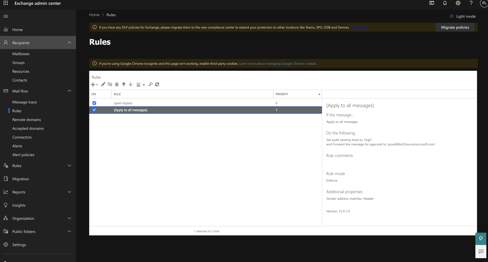

# PwC Project

## Live Application URL

### https://cs319-pwc.herokuapp.com/

## Prerequisites

### Install Node JS
Refer to https://nodejs.org/en/ to install nodejs

### Install create-react-app
Install create-react-app npm package globally. This will help to easily run the project and also build the source files easily. Use the following command to install create-react-app

```bash
npm install -g create-react-app
```
## Live Application URL

The Application is being deployed @ https://cs319-pwc.herokuapp.com/

Click on the link to see the application

## Cloning and Running the Application in local

Clone the project into local

### Frontend (React + Redux + Material UI)

Install all the yarn packages. Go into the project folder and type the following command to install all yarn packages

```bash
yarn install
```

In order to run the application Type the following command

```bash
yarn start
```
NOTE: Also, add a proxy field pointing to the backend in the package.json file.
Ex: "proxy": "http://localhost:8080"

The Application Runs on **localhost:3000**

### Backend (SpringBoot + MYSQL + Hibernate + JPA)

JDK/JRE Version: JAVA 8 

You can use IntelliJ or Eclipse for Java Development.
Firstly, begin with installing all the maven dependencies in the project. Go into the project folder and type the following command to install all maven dependencies.

```bash
mvn clean install -DskipTests
```

In order to run the application, Go to the Cpsc319Application.java file and run it

The Application Runs on **localhost:8080**
## Application design

### Microsoft Exchange Server
Java API for EWS (Exchange Web Services): https://github.com/OfficeDev/ews-java-api
Getting Starting guide: https://github.com/OfficeDev/ews-java-api/wiki/Getting-Started-Guide

EWS(Python counter-part): https://github.com/ecederstrand/exchangelib

Setting up the server: 
Check [this document]( 
https://docs.microsoft.com/en-us/exchange/client-developer/exchange-web-services/setting-up-your-exchange-application-development-environment) 
and [this resource](https://docs.microsoft.com/en-us/office/developer-program/microsoft-365-developer-program-get-started)
for getting started with a exchange developer environment

After the setup has been completed and fake data by Microsoft has been added for a fake organization.
Following setup needs to be done for the application to run successfully:

1. Add a mail flow rule in [Microsoft Exchange Admin Center](https://admin.exchange.microsoft.com/) for moderation 
2. Exchange url: https://outlook.office365.com/ews/exchange.asmx should be used with your newly created organization username and password to find the EWS

After this small setup, the Processor Service and Pull Service can be easily modified to use with other third-party email services.
When the application is started, a Pull Subscription is created with the Exchange server, that on regular intervals checks the inbox folder to moderate incoming emails.

### MYSQL Database
#### Entities: 
**Email:** (id, from, to, cc, bcc, subject, body, condition, iteratedCondition, score)

**Attachments:** (id, name, size, email_id)

**Rule:** (id, name, parameter, isInactive, risk_level, rule_type)

**EmailRuleMatch:** (id, email_id, rule_id)

**Rule Types:** DOMAIN, KEYWORD, FREQUENCY, SIZE, NO_OF_ATTACHMENTS, ATTACHMENT_SIZE, ATTACHMENT_NAME, USERNAME_ITERATION, ASCII, BLACKLIST

### Frontend Components
##### Dashboard:
 On this page a user can view stats for emails, users, rules and email-rule trend for daily, monthly, weekly and yearly.
##### Rules Page: 
Shows Active and Inactive rules with its risk level. User is able to add, edit, delete rules on this page. At the bottom of the page, user is able to set the risk level configuration for Clean, Suspicious and Quarantined emails.
##### Emails Page:
 Shows a table of emails processed by the system with its score, status and list of rule hits (if any)

### Libraries

**ews-java-api** for connecting with Microsoft Exchange.

**Material UI** library is being used as a resource for icons, styling and re-usable components.

## CI-CD / DEPLOY

**Github Actions** have been configured to run a build to test the code in the review stage and for a safe check before merging

If there happens to be a merge on master, another action would kickstart that would build the release of the entire code and deploy it on Heroku.

Note: You might need to setup your own project / configure your secret api key from heroku as well

## Resources

**create-react-app** : The following link has all the commands that can be used with create-react-app
https://github.com/facebook/create-react-app

**ReactJS** : Refer to https://reactjs.org/ to understand the concepts of ReactJS
